# Presentation

On March 2026, TCM Security organized a Blue Team CTF. This first time TCM Blue Team CTF designed by [MalwareCube](https://github.com/malwarecube) was made to test our forensics skills.

Link of the event:

- https://ctf.tcmsecurity.com/?hsCtaAttrib=209031787124

Here is the decription we could read on the CTF website:


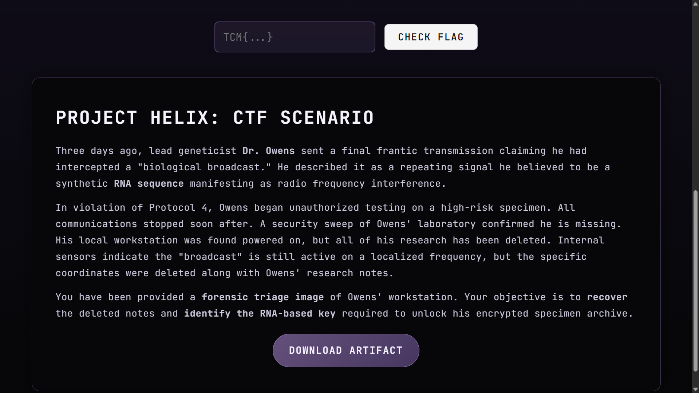


## Project Helix: CTF Scenario

Three days ago, lead geneticist **Dr. Owens** sent a final frantic transmission claiming he had intercepted a "biological broadcast." He described it as a repeating signal he believed to be a synthetic **RNA sequence** manifesting as radio frequency interference.

In violation of Protocol 4, Owens began unauthorized testing on a high-risk specimen. All communications stopped soon after. A security sweep of Owen's laboratory confirmed he is missing. His local workstation was found powered on, but all of his research has been deleted. Internal sensors indicate the "broadcast" is still active on a localized frequency, but the specific coordinates were deleted along with Owen's research notes.

You have been provided a **forensic triage image** of Owens' workstation. Your objective is to **recover** the deleted notes and **identify the RNA-based key** required to unlock his encrypted specimen archive.

- DOWNLOAD ARTIFACT button

https://ctf.tcmsecurity.com/2026-02-25T224057_Triage.zip

---

# Investigation

The different steps for this investigation were:

1. Analysis of the archive
2. Triage with Kape
3. Finding freq.lnk
4. Analyzing $MFT
5. Dealing with the Frequency Machine
6. Recorded audio decoding
7. Decompressing the archive and submitting the CTF
8. Conclusion

For this investigation I created a Windows Server 2025 VM with some Forensic tools:
- Eric Zimmerman's tool
- Kape
- FTK Image
- Arsenal Image Mounter

I create 3 folders on the C drive:
- "C:\Tools" to copy the forensics tools
- "C:\Cases" for the output and files generated by these tools
- "C:\2026-02-25T224057_Triage" with the content of the archive provided with the "DOWNLOAD ARTIFACT" button

## 1 - Analysis of the archive

After downloading 2026-02-25T224057_Triage.zip I checked the aspect of the archive and its content.

``` PowerShell
Mode                 LastWriteTime         Length Name
----                 -------------         ------ ----
-a----        11/03/2026     18:10       75557492 2026-02-25T224057_Triage.zip
```

Here is a quick detail analysis:
- 72 MB
- Inside:
	- A folder
		- C
	- Total size (uncompressed)
		- 555 MB
	- Number of files
		- 593
	- Number of directory (excluding C)
		- 177

Inside C directory (first level):
``` PowerShell
Mode                 LastWriteTime         Length Name
----                 -------------         ------ ----
d-----        11/03/2026     18:10                $Extend
d-----        11/03/2026     18:10                ProgramData
d-----        11/03/2026     18:10                Users
d-----        11/03/2026     18:10                Windows
-a----        11/03/2026     18:10           8192 $Boot
-a----        11/03/2026     18:10       67108864 $LogFile
-a----        11/03/2026     18:10      254541824 $MFT
-a----        11/03/2026     18:10        1857904 $Secure_$SDS
```

Ok so this is not an ISO inside the archive but the structure of a disk with files and folders.

---

## 2 - Triage with Kape

In order to triage the data I use Kape.

Here are the Kape parameters I used for the investigation:

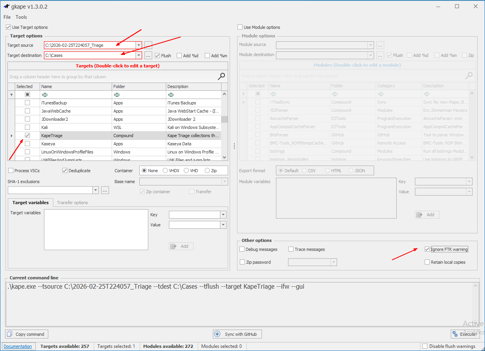

- gkape
	- Use Target options
		- Target source
			- C:\2026-02-25T224057_Triage
		- target destination
			- C:\Cases
		- KapeTriage
			- Checked
	- Other options
		- Ignore FTK warning
			- Checked
	- Execute!
		- OK

Command in text mode:
```
.\kape.exe --tsource C:\2026-02-25T224057_Triage\C --tdest C:\Cases --tflush --target KapeTriage --ifw --gui
```

Result:
``` PowerShell
KAPE version 1.3.0.2, Author: Eric Zimmerman, Contact: https://www.kroll.com/kape (kape@kroll.com)

KAPE directory: C:\Tools\Kape
Command line:   --tsource C:\2026-02-25T224057_Triage\C --tdest C:\Cases --tflush --target KapeTriage --ifw --gui

System info: Machine name: WIN-VGS8FR01O17, 64-bit: True, User: Administrateur OS: WindowsServer2016 (10.0.26100)

Using Target operations
  Flushing target destination directory C:\Cases
  Creating target destination directory C:\Cases
Found 14 targets. Expanding targets to file list...
Target ApplicationEvents with Id 2da16dbf-ea47-448e-a00f-fc442c3109ba already processed. Skipping!
Target ApplicationEvents with Id 2da16dbf-ea47-448e-a00f-fc442c3109ba already processed. Skipping!
Target ApplicationEvents with Id 2da16dbf-ea47-448e-a00f-fc442c3109ba already processed. Skipping!
Target ApplicationEvents with Id 2da16dbf-ea47-448e-a00f-fc442c3109ba already processed. Skipping!
Target ApplicationEvents with Id 2da16dbf-ea47-448e-a00f-fc442c3109ba already processed. Skipping!
Found 567 files in 1.225 seconds. Beginning copy...
  Deferring C:\2026-02-25T224057_Triage\C\$Extend\$UsnJrnl:$J due to NotSupportedException...
  Deferring C:\2026-02-25T224057_Triage\C\$Extend\$UsnJrnl:$Max due to NotSupportedException...
  Deferring C:\2026-02-25T224057_Triage\C\$Secure:$SDS due to NotSupportedException...
  Deferring C:\2026-02-25T224057_Triage\C\$Extend\$RmMetadata\$TxfLog\$Tops:$T due to NotSupportedException...
Deferred file count: 4. Copying locked files...
File C:\2026-02-25T224057_Triage\C\$Extend\$UsnJrnl:$J does not exist! Skipping!
File C:\2026-02-25T224057_Triage\C\$Extend\$UsnJrnl:$Max does not exist! Skipping!
File C:\2026-02-25T224057_Triage\C\$Secure:$SDS does not exist! Skipping!
File C:\2026-02-25T224057_Triage\C\$Extend\$RmMetadata\$TxfLog\$Tops:$T does not exist! Skipping!

Copied 563 out of 567 files in 14.7377 seconds. See C:\Cases\2026-03-11T19_34_43_6735590_CopyLog.csv for copy details

Total execution time: 14.7391 seconds


Press any key to exit
```

- Inside C:\Cases
``` PowerShell
Mode                 LastWriteTime         Length Name
----                 -------------         ------ ----
d-----        11/03/2026     20:34                C
-a----        11/03/2026     20:34           2798 2026-03-11T19_34_43_6735590_ConsoleLog.txt
-a----        11/03/2026     20:34         216043 2026-03-11T19_34_43_6735590_CopyLog.csv
```

Inside C:\Cases\C\2026-02-25T224057_Triage\C\Users

```
Mode                 LastWriteTime         Length Name
----                 -------------         ------ ----
d-----        11/03/2026     20:34                Default
d-----        11/03/2026     20:34                defaultuser0
d-----        11/03/2026     20:34                drowens
d-----        11/03/2026     20:34                Public
```
---

## 3 - Finding freq.lnk

I just gave a quick look into the folder of Dr OWENS just in case I find something interesting.

I found:
- C:\Cases\C\2026-02-25T224057_Triage\C\Users\drowens\AppData\Roaming\Microsoft\Windows\Recent\freq.lnk

So I read the file in hexadecimal:
```
4c 20 20 20 01 14 02 20 20 20 20 20 c0 20 20 20 20 20 20 46 9b 20 20 20 20 20 20 20 39 36 b8 85 a7 a6 dc 01 d1 b9 c8 85 a7 a6 dc 01 d1 b9 c8 85 a7 a6 dc 01 ee ba 06 20 20 20 20 20 01 20 20 20 20 20 20 20 20 20 20 20 20 20 20 20 70 20 14 20 1f 20 05 39 8e 08 23 03 02 4b 98 26 5d 99 42 8e 11 5f 5a 20 32 20 20 20 20 20 20 20 20 20 80 20 66 72 65 71 2e 74 78 74 20 20 42 20 09 20 04 20 ef be 20 20 20 20 20 20 20 20 2e 20 20 20 20 20 20 20 20 20 20 20 20 20 20 20 20 20 20 20 20 20 20 20 20 20 20 20 20 20 66 20 72 20 65 20 71 20 2e 20 74 20 78 20 74 20 20 20 18 20 20 20 52 20 20 20 1c 20 20 20 01 20 20 20 1c 20 20 20 2d 20 20 20 20 20 20 20 51 20 20 20 11 20 20 20 03 20 20 20 a2 cf f6 7e 10 20 20 20 20 43 3a 5c 55 73 65 72 73 5c 64 72 6f 77 65 6e 73 5c 44 6f 77 6e 6c 6f 61 64 73 5c 66 72 65 71 2e 74 78 74 20 20 21 20 2e 20 2e 20 5c 20 2e 20 2e 20 5c 20 2e 20 2e 20 5c 20 2e 20 2e 20 5c 20 2e 20 2e 20 5c 20 44 20 6f 20 77 20 6e 20 6c 20 6f 20 61 20 64 20 73 20 5c 20 66 20 72 20 65 20 71 20 2e 20 74 20 78 20 74 20 1a 20 43 20 3a 20 5c 20 55 20 73 20 65 20 72 20 73 20 5c 20 64 20 72 20 6f 20 77 20 65 20 6e 20 73 20 5c 20 44 20 6f 20 77 20 6e 20 6c 20 6f 20 61 20 64 20 73 20 60 20 20 20 03 20 20 a0 58 20 20 20 20 20 20 20 68 65 6c 69 78 20 20 20 20 20 20 20 20 20 20 20 92 c7 bf 67 25 46 8c 4a 84 df 52 d4 b1 b7 3a 09 58 3a cc 59 9a 12 f1 11 a3 ad 20 0c 29 c4 36 f7 92 c7 bf 67 25 46 8c 4a 84 df 52 d4 b1 b7 3a 09 58 3a cc 59 9a 12 f1 11 a3 ad 20 0c 29 c4 36 f7 45 20 20 20 09 20 20 a0 39 20 20 20 31 53 50 53 b1 16 6d 44 ad 8d 70 48 a7 48 40 2e a4 3d 78 8c 1d 20 20 20 68 20 20 20 20 48 20 20 20 08 a8 d6 c3 e8 90 9f 43 82 b0 2b 52 30 d5 08 6c 20 20 20 20 20 20 20 20 20 20 20 20  
```

... and in ASCII:
```
L        À      F›       96¸…§¦Üѹȅ§¦Üѹȅ§¦Üîº                    p   9Ž#K˜&]™BŽ_Z 2         € freq.txt  B 	  ï¾        .                             f r e q . t x t      R            -       Q         ¢Ïö~    C:\Users\drowens\Downloads\freq.txt  ! . . \ . . \ . . \ . . \ . . \ D o w n l o a d s \ f r e q . t x t  C : \ U s e r s \ d r o w e n s \ D o w n l o a d s `      X       helix           ’Ç¿g%FŒJ„ßRÔ±·:	X:ÌYšñ£­ )Ä6÷’Ç¿g%FŒJ„ßRÔ±·:	X:ÌYšñ£­ )Ä6÷E   	   9   1SPS±mD­pH§H@.¤=xŒ   h    H   ¨ÖÃ萟C‚°+R0Õl            
```

-> Found:
	- A file called "C:\Users\drowens\Downloads\freq.txt"
		- But this file does not exist any longer in the specified folder
	- "helix" appears in this link
        - Interesting

---

## 4 - Analyzing $MFT

Then I choose to analyze $MFT file because this file may keep traces. But this is a big file (242 MB). Maybe I will find removed files.

I use MFTECmd.exe which is a Windows Command Prompt software which can convert data found in a $MFT file into CSV data (NOT working with PowerShell!!!).


``` PowerShell
C:\Tools\EZ Tools\net9>MFTECmd.exe -f "C:\Cases\C\2026-02-25T224057_Triage\C\$MFT" --csv C:\Cases\Analysis\NTFS --csvf MFT.csv
MFTECmd version 1.3.0.0

Author: Eric Zimmerman (saericzimmerman@gmail.com)
https://github.com/EricZimmerman/MFTECmd

Command line: -f C:\Cases\C\2026-02-25T224057_Triage\C\$MFT --csv C:\Cases\Analysis\NTFS --csvf MFT.csv

File type: Mft

Processed C:\Cases\C\2026-02-25T224057_Triage\C\$MFT in 3,9789 seconds

C:\Cases\C\2026-02-25T224057_Triage\C\$MFT: FILE records found: 223 852 (Free records: 24 619) File size: 242,8MB
        CSV output will be saved to C:\Cases\Analysis\NTFS\MFT.csv


C:\Tools\EZ Tools\net9>
```

MFT.csv
- Big file: 169 MB.

I use Timeline Explorer to explore the content of the CSV file.
- Search
	- helix
		- Nothing
	- freq
		- Found something
		- Size
			- 441070 Bytes

3 results over 359917 lines for "freq" but 1 was more interesting than the others:

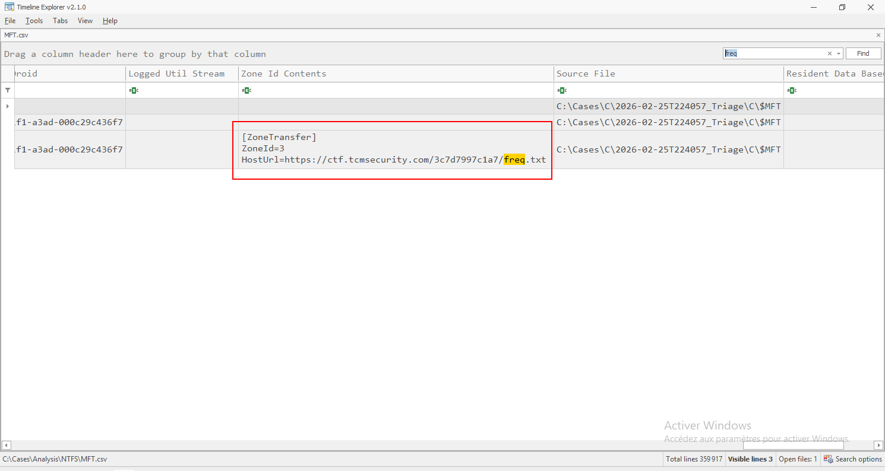

Here are the 3 results in text format:

- freq.lnk
```
Line	Tag	Entry Number	Sequence Number	In Use	Parent Entry Number	Parent Sequence Number	Parent Path	File Name	Extension	File Size	Reference Count	Reparse Target	Is Directory	Has Ads	Is Ads	SI<FN	u Sec Zeros	Copied	Si Flags	Name Type	Created0x10	Created0x30	Last Modified0x10	Last Modified0x30	Last Record Change0x10	Last Record Change0x30	Last Access0x10	Last Access0x30	Update Sequence Number	Logfile Sequence Number	Security Id	Object Id File Droid	Logged Util Stream	Zone Id Contents	Source File	Resident Data Base64	Resident Data Hex	Resident Data ASCII
318101	Unchecked	207688	3	True	143553	5	.\Users\drowens\AppData\Roaming\Microsoft\Windows\Recent	freq.lnk	.lnk	563	1		False	False	False	False	False	False	Archive	DosWindows	2026-02-25 22:38:55.1475366		2026-02-25 22:38:55.1475366		2026-02-25 22:38:55.1475366		2026-02-25 22:41:07.0188714	2026-02-25 22:38:55.1475366	307789152	1463643583	1913				C:\Cases\C\2026-02-25T224057_Triage\C\$MFT			
```

- freq.txt
```
Line	Tag	Entry Number	Sequence Number	In Use	Parent Entry Number	Parent Sequence Number	Parent Path	File Name	Extension	File Size	Reference Count	Reparse Target	Is Directory	Has Ads	Is Ads	SI<FN	u Sec Zeros	Copied	Si Flags	Name Type	Created0x10	Created0x30	Last Modified0x10	Last Modified0x30	Last Record Change0x10	Last Record Change0x30	Last Access0x10	Last Access0x30	Update Sequence Number	Logfile Sequence Number	Security Id	Object Id File Droid	Logged Util Stream	Zone Id Contents	Source File	Resident Data Base64	Resident Data Hex	Resident Data ASCII
335755	Unchecked	207685	4	False	143537	5	.\Users\drowens\Downloads	freq.txt	.txt	441070	1		False	True	False	True	False	False	Archive	DosWindows	2026-02-25 22:38:54.7463737	2026-02-25 22:38:54.8515459	2026-02-25 22:38:55.7211484	2026-02-25 22:38:54.8546001	2026-02-25 22:38:55.7211484	2026-02-25 22:38:54.8546001	2026-02-25 22:38:55.7211484	2026-02-25 22:38:54.8546001	307793144	1462740751	1913	59cc3a58-129a-11f1-a3ad-000c29c436f7			C:\Cases\C\2026-02-25T224057_Triage\C\$MFT			
```

- freq.txt:Zone.Identifier
```
Line	Tag	Entry Number	Sequence Number	In Use	Parent Entry Number	Parent Sequence Number	Parent Path	File Name	Extension	File Size	Reference Count	Reparse Target	Is Directory	Has Ads	Is Ads	SI<FN	u Sec Zeros	Copied	Si Flags	Name Type	Created0x10	Created0x30	Last Modified0x10	Last Modified0x30	Last Record Change0x10	Last Record Change0x30	Last Access0x10	Last Access0x30	Update Sequence Number	Logfile Sequence Number	Security Id	Object Id File Droid	Logged Util Stream	Zone Id Contents	Source File	Resident Data Base64	Resident Data Hex	Resident Data ASCII
335756	Unchecked	207685	4	False	143537	5	.\Users\drowens\Downloads	freq.txt:Zone.Identifier	.Identifier	84	1		False	False	True	True	False	False	Archive	DosWindows	2026-02-25 22:38:54.7463737	2026-02-25 22:38:54.8515459	2026-02-25 22:38:55.7211484	2026-02-25 22:38:54.8546001	2026-02-25 22:38:55.7211484	2026-02-25 22:38:54.8546001	2026-02-25 22:38:55.7211484	2026-02-25 22:38:54.8546001	307793144	1462740751	1913	59cc3a58-129a-11f1-a3ad-000c29c436f7		"[ZoneTransfer]
ZoneId=3
HostUrl=https://ctf.tcmsecurity.com/3c7d7997c1a7/freq.txt"	C:\Cases\C\2026-02-25T224057_Triage\C\$MFT			
```

-> Dr Owens has downloaded the file from a site!

- Site
	- https://ctf.tcmsecurity.com/3c7d7997c1a7/freq.txt

- File size
    - 441 070 bytes
    - Same size as the file downloaded by drowens account

I will do the same...

I use a Web browser and... it works!

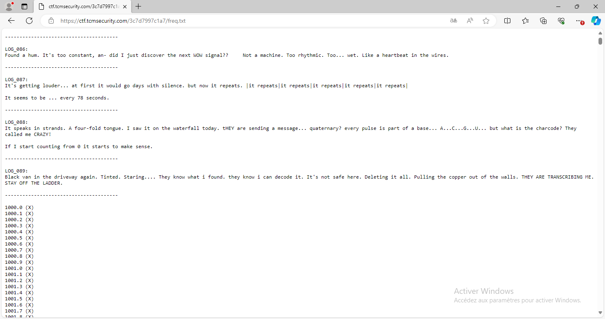

Here is the content of the file in text mode (I removed a part of it):
```
---------------------------------------

LOG_086:
Found a hum. It's too constant, an- did I just discover the next WOW signal??     Not a machine. Too rhythmic. Too... wet. Like a heartbeat in the wires.

---------------------------------------

LOG_087:
It's getting louder... at first it would go days with silence. but now it repeats. |it repeats|it repeats|it repeats|it repeats|it repeats|

It seems to be ... every 78 seconds.

---------------------------------------

LOG_088:
It speaks in strands. A four-fold tongue. I saw it on the waterfall today. tHEY are sending a message... quaternary? every pulse is part of a base... A...C...G...U... but what is the charcode? They called me CRAZY!

If I start counting from 0 it starts to make sense.

---------------------------------------

LOG_089:
Black van in the driveway again. Tinted. Staring.... They know what i found. they know i can decode it. It's not safe here. Deleting it all. Pulling the copper out of the walls. THEY ARE TRANSCRIBING ME. STAY OFF THE LADDER.

---------------------------------------

1000.0 (X)
1000.1 (X)
1000.2 (X)
1000.3 (X)
1000.4 (X)
1000.5 (X)
1000.6 (X)
1000.7 (X)
1000.8 (X)
1000.9 (X)
1001.0 (X)
1001.1 (X)
1001.2 (X)
1001.3 (X)
1001.4 (X)
1001.5 (X)
1001.6 (X)
1001.7 (X)
1001.8 (X)
1001.9 (X)
1002.0 (X)
1002.1 (X)
1002.2 (X)
1002.3 (X)
1002.4 (X)
1002.5 (X)
1002.6 (X)
1002.7 (X)
1002.8 (X)
1002.9 (X)
1003.0 (X)
1003.1 (X)
1003.2 (X)
1003.3 (X)
1003.4 (X)
1003.5 (X)
1003.6 (X)
1003.7 (X)
1003.8 (X)
1003.9 (X)
1004.0 (X)
1004.1 (X)
1004.2 (X)
1004.3 (X)
1004.4 (X)
1004.5 (X)
1004.6 (X)
1004.7 (X)
1004.8 (X)
1004.9 (X)

[...]

3817.2 (X)
3817.3 (?)
3817.4 (X)

[...]

4998.8 (X)
4998.9 (X)
4999.0 (X)
4999.1 (X)
4999.2 (X)
4999.3 (X)
4999.4 (X)
4999.5 (X)
4999.6 (X)
4999.7 (X)
4999.8 (X)
4999.9 (X)
```

- Values go from 1000 to 4999.9 incrementing by 0.1 seem pointless but that makes a big file
- There is something about quaternary
	- base4?
- Some files were removed intentionaly by Dr Owens
- Files to download ?
	- LOG_086
	- LOG_087
	- LOG_088
	- LOG_089

## 5 - Dealing with the Frequency Machine

I try to remove the name of the file in the URL to see if I can find something:
- https://ctf.tcmsecurity.com/3c7d7997c1a7/
	- It works!
	- I have found the decoder (?) of the TCM video of "Project Helix Blue Team CTF Teaser - Coming Wednesday!"
		- Just for reference:
			- https://www.youtube.com/watch?v=QMic8tfTVuA
	- I launch the thing
		- Well no sound interesting at first sight
- There is a file to download
	- "ACQUIRE SPECIMEN" button
	- https://ctf.tcmsecurity.com/3c7d7997c1a7/flag.zip
	- Size
		- 231 Bytes

Here is the Frequency Machine:

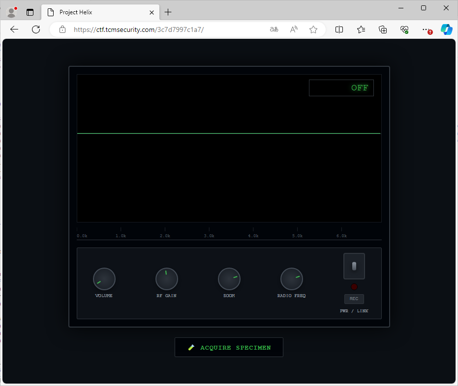

The zipped file refuses to be open:

flag.txt in ASCII:
```
PK3  c YƒE\    ;        flag.txt™  AE  ΆpÄ4•ê¦¢W;fí oþ6±I
ï}Œ ™0aéÀè/‚")y ³§Á³Ê
³Ö¤o¹³'PK?3  c YƒE\    ;       /        €¤    flag.txt
         0Vü"æ–Ü                ™  AE  PK      e   l     
```

I am thinking about the Frequency Machine: maybe a frequency to find?

I make a recording (it happens every 78 minutes). I use the frequency of the teasing video (1914 Hz).
- Well...

Oh I found that:
``` PowerShell
PS C:\Cases\Analysis> gc .\freq.txt | ?{$_ -notmatch '(X)'}
---------------------------------------

LOG_086:

---------------------------------------

LOG_087:
It's getting louder... at first it would go days with silence. but now it repeats. |it repeats|it repeats|it repeats|it repeats|it repeats|

It seems to be ... every 78 seconds.

---------------------------------------

LOG_088:
It speaks in strands. A four-fold tongue. I saw it on the waterfall today. tHEY are sending a message... quaternary? every pulse is part of a base... A...C...G...U... but what is the charcode? They called me CRAZY!

If I start counting from 0 it starts to make sense.

---------------------------------------

LOG_089:
Black van in the driveway again. Tinted. Staring.... They know what i found. they know i can decode it. It's not safe here. Deleting it all. Pulling the copper out of the walls. THEY ARE TRANSCRIBING ME. STAY OFF THE LADDER.

---------------------------------------

3817.3 (?)
PS C:\Cases\Analysis>
```
-> 3817.3 Hz

I just can get 3817.7 Hz. The button of the frequency is not accurate enough.

File recorded:
- SIG_INT_1773265162914.webm
- 2.40 MB
- Cannot be open with Audacity

I try another approach: bruteforcing the zip file.
- john?

``` bash
┌──(kali㉿kali)-[~/Desktop]
└─$ zip2john flag.zip               
flag.zip/flag.txt:$zip2$*0*3*0*ce867005c43495eaa6a257103b8d660f*ed00*1f*6ffe36b1490a10ef7d8c001099301261e912c0e82f82222979c20018b3a7c1*b3ca0db3d6a46fb9b327*$/zip2$:flag.txt:flag.zip:flag.zip

┌──(kali㉿kali)-[~/Desktop]
└─$ 

```

``` bash
┌──(kali㉿kali)-[~/Desktop]
└─$ john --wordlist=/usr/share/wordlists/rockyou.txt zip_hash.txt
Using default input encoding: UTF-8
Loaded 1 password hash (ZIP, WinZip [PBKDF2-SHA1 256/256 AVX2 8x])
Cost 1 (HMAC size) is 31 for all loaded hashes
Will run 2 OpenMP threads
Press 'q' or Ctrl-C to abort, almost any other key for status
0g 0:00:00:27 7.53% (ETA: 18:58:49) 0g/s 45124p/s 45124c/s 45124C/s thunder2000..the240
0g 0:00:01:46 31.51% (ETA: 18:58:27) 0g/s 44043p/s 44043c/s 44043C/s pilesa..pigkisser
0g 0:00:02:41 48.79% (ETA: 18:58:20) 0g/s 44036p/s 44036c/s 44036C/s jedh7roxie..jeaniece12
0g 0:00:03:11 58.52% (ETA: 18:58:17) 0g/s 44174p/s 44174c/s 44174C/s eastside....eamon!!78
0g 0:00:03:32 65.09% (ETA: 18:58:16) 0g/s 44069p/s 44069c/s 44069C/s cafejam..cachumwnci
0g 0:00:03:54 72.15% (ETA: 18:58:15) 0g/s 44132p/s 44132c/s 44132C/s aggq2804..afzalkhan
0g 0:00:04:25 81.89% (ETA: 18:58:14) 0g/s 44243p/s 44243c/s 44243C/s 8781493..8738872
0g 0:00:04:59 91.65% (ETA: 18:58:17) 0g/s 44196p/s 44196c/s 44196C/s 150libras..1500509953
0g 0:00:05:24 DONE (2026-03-11 18:58) 0g/s 44194p/s 44194c/s 44194C/s !SkicA!..*7¡Vamos!
Session completed. 
                                                                                                                                                            
┌──(kali㉿kali)-[~/Desktop]
└─$ 
```

-> With Rockyou: failed

On the JavaScript console I can read:
``` js
Console was cleared
3c7d7997c1a7/:192  PROJECT HELIX BIOS v4.2.0 
3c7d7997c1a7/:193 Checking System Integrity...
3c7d7997c1a7/:194 Audio Engine: [OK]
3c7d7997c1a7/:117 WebSocket connection to 'wss://ctf.tcmsecurity.com/3c7d7997c1a7?freq=1369.5' failed: 
connect @ 3c7d7997c1a7/:117
powerToggle.onclick @ 3c7d7997c1a7/:377Understand this error
3c7d7997c1a7/:195 WebSocket Link: [GATED]
3c7d7997c1a7/:197 Manual Overrides: Enabled
3c7d7997c1a7/:198 Use RADIO_SYSTEM.update(freq) for direct tuning.
```

-> Can we set a frequency? "wss://ctf.tcmsecurity.com/3c7d7997c1a7?freq=1369.5"

Should be:
```
wss://ctf.tcmsecurity.com/3c7d7997c1a7?freq=3817.3
```

- After a long period of time I finally got:
	- wss://ctf.tcmsecurity.com/3c7d7997c1a7?freq=3817.3

JavaScript console (before I had an error):
``` js
3c7d7997c1a7/:191 Console was cleared
3c7d7997c1a7/:192  PROJECT HELIX BIOS v4.2.0 
3c7d7997c1a7/:193 Checking System Integrity...
3c7d7997c1a7/:194 Audio Engine: [OK]
3c7d7997c1a7/:195 WebSocket Link: [GATED]
3c7d7997c1a7/:197 Manual Overrides: Enabled
3c7d7997c1a7/:198 Use RADIO_SYSTEM.update(freq) for direct tuning.
```

Here is the Frequency Machine getting the correct frequency:

- First a potential "working" value (step 2 below):

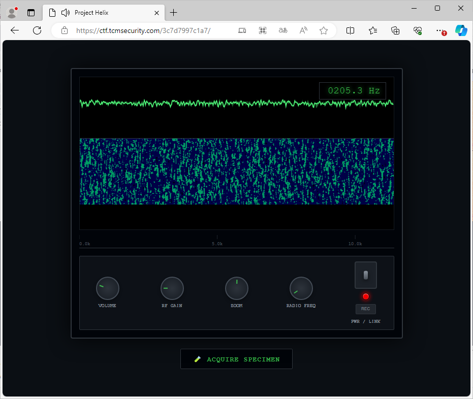

- Next the right value (step 4 below):

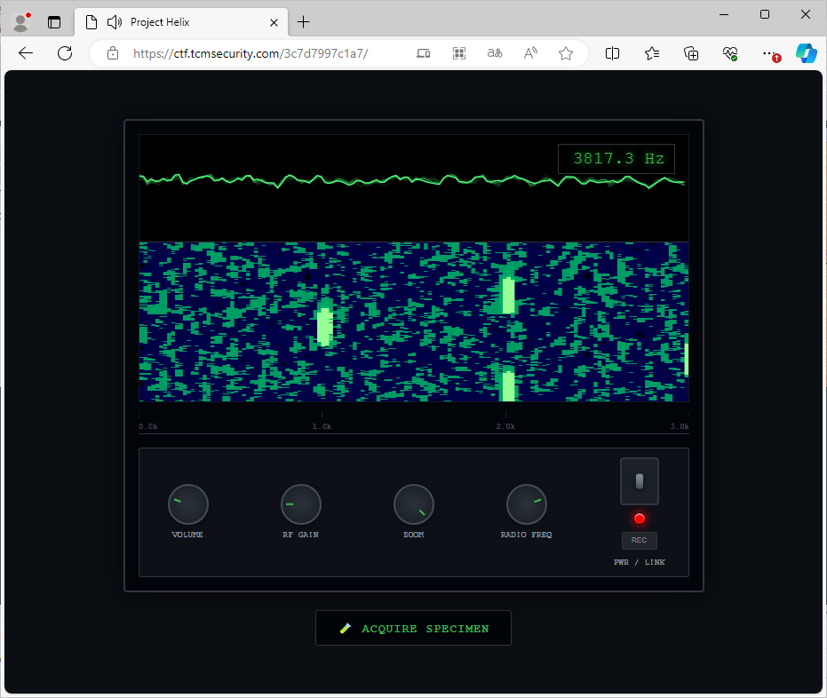


I spent a lot of time here and I did not know what to do. I used a "gold fingers" technique here to get the correct value:
1. I use "ZOOM" button and move it to around middle position (in direction of the top of the screen)
2. Then I use "RADIO FREQ" button to get XXXX.8 or XXXX.3 (it worked with 205.3 Hz and 184.3 Hz)
3. Then I use "ZOOM" button and move it to its max value (on the bottom right). Now "RADIO FREQ" button displays always frequencies increased by sometimes +/-0.5 or often +/-1.0 and rarely +/- 2.0
4. Then I use "RADIO FREQ" button to get "3817.3" (now we only have values ending with XXXX.3 or XXXX.8). In case we get "3817.8" then we have to repeat the process from step 1 and use XXXX.3 in step 2 instead of XXXX.8. In case 3817.X does not appear you have to restart from the beginning too. Unfortunately this not a 100% garanty technique.
- Now I can hear a sound. (beep beep)
- I use the "REC" button and got a file: SIG_INT_1773292241223.webm

- SIG_INT_1773292241223.webm
	- 2,39 MB
	- 2 min 36

I use https://convertio.co/ to convert it to MP3.

## 6 - Recorded audio decoding

I open the mp3 file with Audacity.

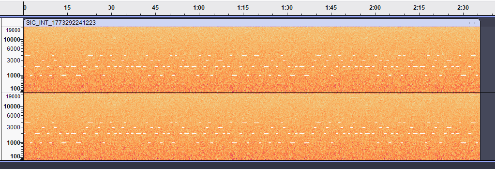


- If I use Spectrogram View in audacity I can see the message in 4 frequencies (the "quaternary" mentioned above)
- The loop (when the whole message is the same) is for a period of 1 min 18 (so 78 minutes)
    - So I remove the audio data after 78 min from the beginning of the recording
- Each bit/frequency lasts around 1 second so it is a 1 Hz element
- Reading the values, frequencies are:
	- 1 kHz, 2 kHz, 3 kHz and 4 kHz
- Each have 1 second of pause
- There are 19 digits and the 4 frequencies + space = 4,1 seconds (78 / 19 = 4,105 sec per digit)


I copy manually all data into a code (1 = 1 kHz, 2 = 2 kHz, etc.) in text format.

Example:

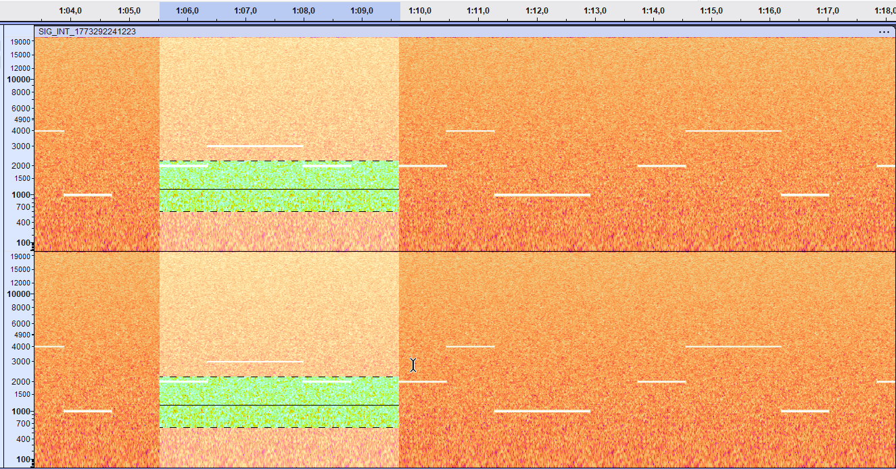

On this example we get:
- 2 kHz, 3 kHz, 3 kHz, 2 kHz = 2332
- Final blank is to seperate data (the pause) and is not coded

Here is the data I get in the coded format:
- 2441
- 2213
- 2143
- 2112
- 2211
- 2344
- 2341
- 2432
- 2342
- 2322
- 2413
- 2312
- 2414
- 2322
- 2214
- 2341
- 2332
- 2411
- 2441

I do not know how to code frequences into quaternary.
- Wikipedia is not giving the solution

I found a quaternary to binary converter:
- https://www.convzone.com/quaternary-to-binary/

First for a quaternary representation I have to remove 1 to each number:
- 1330
- 1102
- 1032
- 1001
- 1100
- 1233
- 1230
- 1321
- 1231
- 1211
- 1302
- 1201
- 1303
- 1211
- 1103
- 1230
- 1221
- 1300
- 1330

Then I convert coded data above from quaternary to binary:

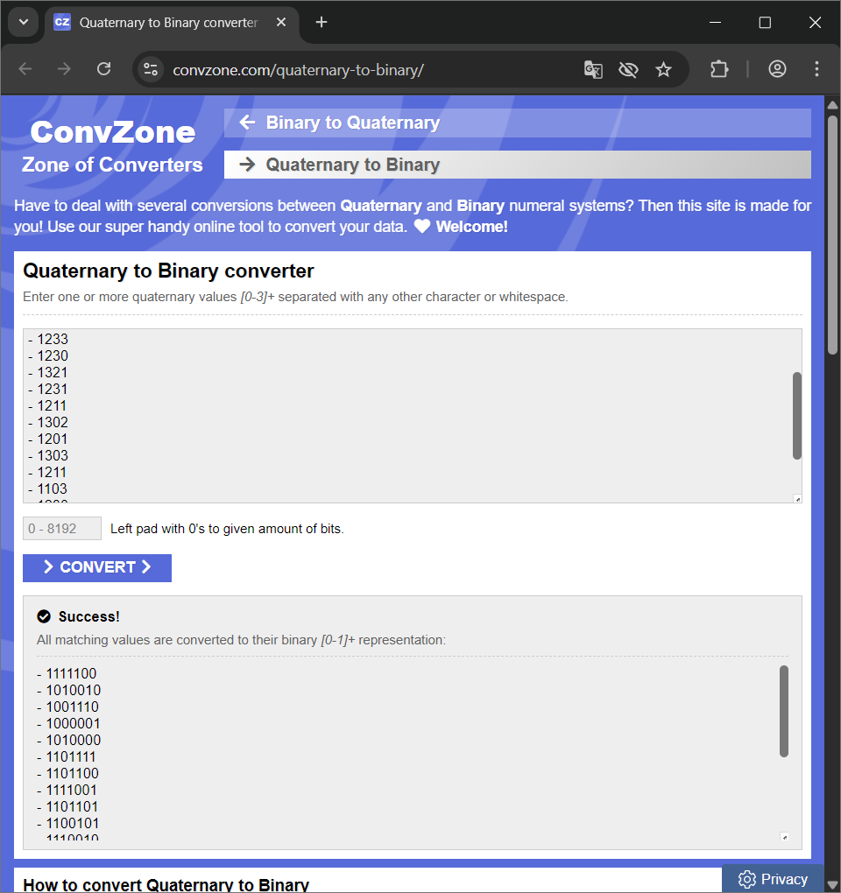

Here is the result:
- 1111100
- 1010010
- 1001110
- 1000001
- 1010000
- 1101111
- 1101100
- 1111001
- 1101101
- 1100101
- 1110010
- 1100001
- 1110011
- 1100101
- 1010011
- 1101100
- 1101001
- 1110000
- 1111100

Then I used CyberChef to decode:

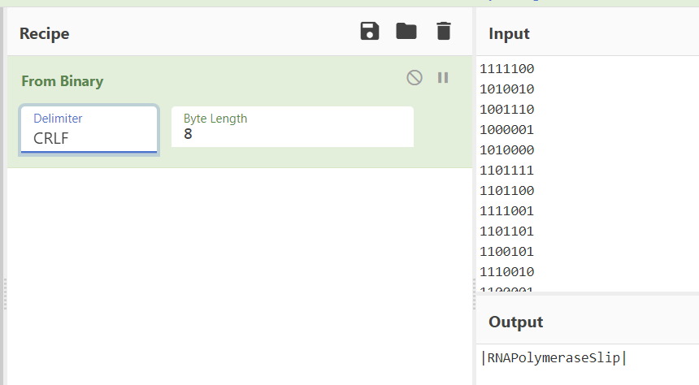

CyberChef:
- From Binary
	- Delimiter
		- CRLF
	- Input
```
1111100
1010010
1001110
1000001
1010000
1101111
1101100
1111001
1101101
1100101
1110010
1100001
1110011
1100101
1010011
1101100
1101001
1110000
1111100
```
- Output
```
|RNAPolymeraseSlip|
```

## 7 - Decompressing the archive and submitting the CTF

Open the flag.zip
- I use the this code to decompress the archive anf got flag.txt:
```
TCM{V01D_S1GN4L_4U7H3N71C473D}
```

I enter the flag into TCM event website:

- Then I am redirected to another URL (ending with "chickendinner"! :D )

https://ctf.tcmsecurity.com/winnerwinnerchickendinner


```
**Entry Received  
**

Thank you, we'll notify the winners by email by March 24th, 2026.
```

---

## 8 - Conclusion

I am glad to have used some skills I learned with TCM. Usually when we use a spectrum analyser, 0.1 Hz of difference is not that important. But here it was crucial and totally stopped me. I spent most of my time on the Frequency Machine. But when I used "gold fingers" technique then things went fine afterwards. It was not easy but I learned many things with this challenge (audio analysis and Base4 encoding for instance). That was a fun challenge!

The time spent for this TCM CTF was:

| Beginning | End | Total | Total excluding a pause of 6 hours and VM & software installation |
|---|---|---|---|
| UTC 18:23 2026-03-11 | UTC 06:43 2026-03-12 | 12:20 | Around 6 hours |
